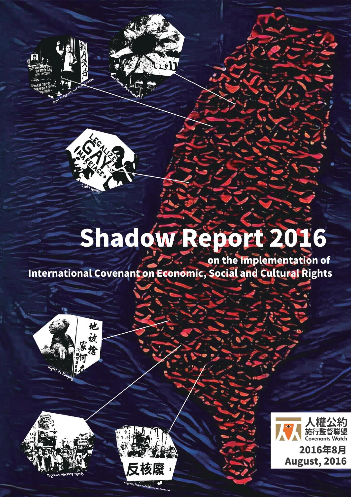

# Shadow Report 2016 on the Implementation of the International Covenant on Economic, Social and Cultural Rights

**Covenants Watch, Taiwan**

**September 3, 2016**

## About the report

The Shadow Report on the Implementation of the International Covenant on Economic, Social and Cultural Rights was prepared for two reasons. First, it complements the government report for the review of the second state human rights reports in January 2017 by international experts; second, it summarizes the disagreement between civil society organizations and the government with regard to human rights issues in Taiwan between 2013 and 2016.

The report is the product of scores of authors affiliated with 79 NGOs, whose names are listed below. Covenants Watch served as the platform of collaboration for this process, with the help of associate editors. The production and translation of this report will not be possible without the support of donations to the 318 Sunflower Movement (managed through the Economic Democracy Union), grants from Taiwan Foundation for Democracy and Taipei Bar Association, Taiwan Alliance to End the Death Penalty, and individual donations to the Covenants Watch.

## Convener

* Song-Lih Huang, Covenants Watch

## Editors

* Yi-Hsiang Shih, Taiwan Association for Human Rights
* Yibee Huang, Covenants Watch
* Yichen Hang, Covenants Watch
* Zi-Ting Su, Covenants Watch
* Associate Editors (in alphabetical order)
* Chang, Feng-Yi, Taiwan Labor Front
* Chen, Huimin, Prison Watch
* Chou, Clarence, Judicial Reform Foundation
* Hang, Yichen, Covenants Watch
* He, Ming-Hsuan, Taiwan Association for Human Rights
* Hsu, I-Fu, Taiwan Alliance of Anti-Forced Eviction
* Hsu, Jen-Shuo, Taiwan Association for Human Rights
* Huang, Yibee, Taiwan International Medical Alliance
* Hung, Sue, Fairtax Taiwan
* Kao, Chen-Yi, Taiwan Alliance of Anti-Forced Eviction
* Liang, Tsu-Ying, TransAsia Sisters Association, Taiwan
* Lin, Hsinyi, Taiwan Alliance to End the Death Penalty
* Lin, Yen-Tung, Taiwan Association for Human Rights
* Su, Ching-Hsuan, Taiwan Association for Truth and Reconciliation
* Tuhi Martukaw, LIMA Taiwan Indigenous Working Group
* Wu, Cheng-Che, Taiwan Alliance for Advancement of Youth Rights and Welfare
* Yen, Shih-I, Foundation for Women’s Rights Promotion and Development
* Yeh, Hung-Ling, Taiwan Association for Truth and Reconciliation

## Contributing Authors’ Affiliations

* Association for Taiwan Indigenous Peoples’ Policies
* Awakening Foundation
* Children’s Rights Alliance Taiwan
* China Cooperation Cooperative societies
* Citizen Media Watch
* Civic and Law-Related Education Foundation
* Civic LGBT Equal Rights Association
* Covenants Watch
* Credit Union League of the Republic of China
* Economic Democracy Union
* Environmental Jurists Association
* Formosa Transnational
* Gay & Lesbian Awakening Days
* Good Toad Studio
* Guishan Self-help Association against Dahu Land Consolidation
* Homeless Workshop of Graduate Institute for Social Transformation Studies
* Huaguang Community Concerned Group
* Indigenous Youth Front
* Intersex, Transgender and Transsexual people care association
* Jing Chuan Child Safety Foundation
* Judicial Reform Foundation
* LIMA Taiwan Indigenous Working Group
* Losheng Self-Help Association and Youth Alliance for Losheng
* Mental Health Association in Taiwan
* Mklesan Tayal Youth Union
* Nameless Indigenous
* National Alliance of Taiwan Women’s Associations
* NTPU CROSS
* NTU Gender Studio
* NTU Student Activist Group Shaoxing Program
* Persons with HIV/AIDS Rights Advocacy Association of Taiwan
* Prison Watch
* RCA Self-Help Association
* Saowac Community
* Social Housing Advocacy Consortium
* Southern Railway Youth
* Tainan Association for the Promotion of Gender Equality
* Taipei Bar Association
* Taipei Women’s Rescue Foundation
* Taiwan Alliance for Advancement of Youth Rights and Welfare
* Taiwan Alliance for Rights of Assembly and Parade
* Taiwan Alliance for Victims of Urban Renewal
* Taiwan Alliance of Anti-Forced Eviction
* Taiwan Alliance to End the Death Penalty
* Taiwan Alliance to Promote Civil Partnership Rights
* Taiwan Association for Disability Rights
* Taiwan Association for Human Rights
* Taiwan Association for Innocence
* Taiwan Association for Truth and Reconciliation
* Taiwan Association for Victims of Occupational Injuries
* Taiwan Bar Association
* Taiwan Coalition Against Violence
* Taiwan Forever Association
* Taiwan Foundation for Rare Disorder
* Taiwan Gender Equity Education Association
* Taiwan Gender Queer Rights Advocacy Alliance
* Taiwan Health Right Initiative
* Taiwan International Medical Alliance
* Taiwan International Workers’ Association
* Taiwan Labor and Social Policy Research Association
* Taiwan Labor Front
* Taiwan Occupational Safety and Health Link
* Taiwan Police Union
* Taiwan Rural Front
* Taiwan Tongzhi (LGBT) Hotline Association
* Taiwan Women’s Link
* Tamhai Phase II Alliance of Self-Help Groups for Anti-Expropriation
* Taoyuan Aeropolis Anti-Eviction Alliance
* The Airport Metro A7 stop Self-help Association
* The Garden of Hope Foundation
* The League for Persons with Disabilities, R.O.C.
* The National Federation of Teachers Unions
* TransAsia Sisters Association, Taiwan
* Vietnamese Migrant Workers and Brides Office
* Wen Zi Zhen Anti-Eviction Alliance
* Wild at Heart Legal Defense Association, Taiwan
* Working poor & Tax Policy Research Center
* Working Poor Unite
* Yuanli Self-Help Group

## License

## Resources

* [Gitbook](https://www.gitbook.com/book/jrf-tw/taiwan-icescr-shadow-report-2016-en/)
