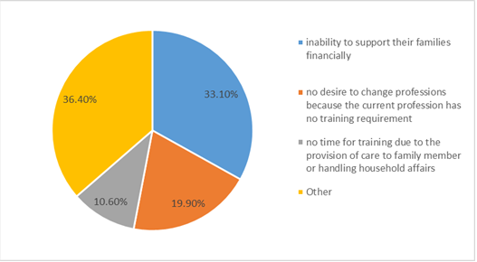

## Article 9 Social Security

### Social Security System

<ol start="138">
  <li>
In response to the Paragraphs 121 and 137 of the <em>First State Report on ICESCR</em>, Article 15 of the <em>Public Assistance Act</em> stipulates, “Municipality and county (city) competent authorities shall, according to needs, provide persons in low-income or middle-to-low-income households who are able to work with vocational training, employment services, business initiation aid, or work relief programs to help them to be self-sufficient.” However, central and local governments frequently commission contractors to provide employment services to disadvantaged groups to conserve budget and human resources. According to the survey statistics announced by the Control Yuan in 2013, the Council of Labor Affairs (former Ministry of Labor) employed 1,672 formal personnel and contracted 1,829 labor dispatch personnel, becoming the leading public organization in Taiwan in terms of employing dispatch labor (formal-dispatch personnel ratio of 1.09:1). The majority of the dispatched personnel are distributed among employment services stations, creating a situation in which atypical disadvantaged groups are providing employment services to financially disadvantaged groups. This situation is ineffectual for improving the quality of employment services.
</li>

  <li>
A survey of low- and middle-income households show that only 5.7% of capable household earners are trained professionals. The other 94.3% remains untrained. Among the untrained and financially disadvantaged persons, the primary reason for the unwillingness to receive training is the “inability to support their families financially” (33.1%), followed by “no desire to change professions because the current profession has no training requirement” (19.9%) and “no time for training due to the provision of care to family member or handling household affairs” (10.6%; Fig. 1). These statistics imply that although existing laws and regulations offer employment services to financially disadvantaged persons, the subsidization provided during the training period is inadequate to be subsistence requirements, resulting in a relative low willingness to receive training. Moreover, although the existing laws and regulations require municipality and county (city) competent authorities to organize professional training, the majority of counties and cities lack the resources to organize such courses. Instead, they opt to outsource training courses to private training institutes, leading to an increased degree of overlap among institutions. To remain competitive, training institutes focus on helping learners obtain professional certificates. This situation has actuated an unusual phenomenon in Taiwan where national licenses have become so common they no longer facilitate employment. Statistics released by the Ministry of Labor in 2014 show that 433,212 skill certificates were issued in that year. Among these certificates, 40,168 were for Chinese cooking (9.27%), and 12,508 were for web page design. These statistics shared similar results for low- and middle-income households. Among financially disadvantaged persons willing to receive training, 29% selected catering- and service-related courses and 25% selected computer- or information-related courses. These outcomes imply that with the immense number of financially disadvantaged persons funneling into similar courses, a sharp rise in competition in these industries will inevitably rise. Thus, helping financially disadvantaged persons out of poverty is almost impossible without the provision of individualized services and training policies.
</li>

  <li>
We recommend completely revising the <em>Vocational Training Act</em> to facilitate future industries formulate plans to satisfy human resource requirements. This plan can then be applied to diversify professions, train enterprises, and provide hiring incentives. In addition, training allowance for financially disadvantaged persons during the training period should be reasonably increased as an incentive for participation.
</li>
  
  <figure>
    
    <figcaption>Figure 1 Reason not to receive training</figcaption>
  </figure>
</ol>

### Social Welfare Budget

<ol start="141">
  <li>
Figure 2 Government Deficit, by year, (unit: hundred thousand NTD)

  
  <figure>
    
    <figcaption>Figure 2 Government Deficit, by year, (unit: hundred thousand NTD)</figcaption>
  </figure>

  </li>

  <li>
In response to Paragraph 111 of the <em>Second State Report on ICESCR</em>, the increase in the social welfare budget was fundamentally an increase in cash transfers. For a long period, Taiwanese political parties have formulated various cash transfer policies to lobby votes. These policies have reduced social welfare to the transfer of cash. In a news report published in 2012, a former government official serving in the Ministry of the Interior confessed that cash transfers accounted for 94% of the social welfare budget in 201226. At the same time, central and local governments manifested increasing financial deficit. The cumulative debt of the central and local governments increased from NT $4.29 trillion in 2007 to NT $6.36 trillion in 2016, which is a 148% increase in a decade (Fig. 2). In terms of the social welfare budget, the gradual increase in social welfare expenses is evidently attributed to political endeavors, in which politicians are eagerly willing to tap into the wealth of future generations to expand social welfare and, simultaneously, gain a political advantage. Many previous studies have warned that cash transfer policies may unintentionally exclude those truly in need, such as children and women, and that an overdependence of cash transfers severely hinders the provision of other services in social welfare policies. In addition, resource crowding destabilizes service quality. Cash transfers may also encourage women to leave the workforce and commit their time to household affairs, leading to a decline in the employment rate of middle-aged women (Fig. 3).
</li>

  <figure>
    
    <figcaption>Figure 3 Labor Participation Rate of 2015, by age group and sex</figcaption>
  </figure>

  <li>
We recommended returning social welfare to a centralized management system and reviewing the rationality of the social welfare budget and relevant expenses, thereby eliminating unnecessary cash transfer policies (e.g., free dentures for older adults over the age of 65 and free National Health Insurance for older adults over the age of 70), preventing local elections from excessively using welfare to their advantage but deepening the debt for future generations to cover, and ensuring the consistency in welfare eligibility and provision. The proportion of cash transfers can be gradually reduced to roughly 65% of the social welfare budget within a period of a decade, which is the average for the 28 OECD member countries. The retained budget can then be converted to providing public services, such as long-term health care or day care services. This approach would not only alleviate the government’s financial burden but also create more job opportunities for a variety of services.
</li>
</ol>

### Social Assistance and Allowance

<ol start="144">
  <li>
In response to Paragraph 113 of the <em>Second State Report on ICESCR</em>, Article 5-1, Paragraph 2 of the <em>Public Assistance Act</em> states, “For persons who are capable of working but are unemployed, the calculation shall be based on base pay. As for persons who are recognized by the public employment service center as unemployed, including those who are at the age of 55 or elder or jobless after having failed to find a job after three job matches have been conducted by the public employment service center, or who are participating in full-time vocational training, the period of unemployment will not be used in calculation. Unemployment benefits shall be listed and calculated as other income.”
</li>

  <li>
This provision serves to prevent welfare dependence. As a counter effect, it classifies long-term unemployed persons as persons receiving a base income (NT $20,008 as of 2015), which exceeds the minimum income bracket set in various cities and counties. Thus, long-term unemployed persons are marginalized from the social assistance system. Although the <em>Public Assistance Act</em> also excluded unemployed persons from imputed income calculations, unemployment benefits are only paid for a maximum of six months, which can be extended to nine months for specific cases, such as middle- to old-age unemployment and financial hardship. Those that fail to secure employment after six months no longer receive support. The number of long-term unemployed persons (people who are unemployed for over twelve months) are gradually increasing. A total of 72,000 long-term unemployed persons were recorded in 2015 with an additional 60,000 persons unemployed for six to eleven months. The two groups account for 31.4% of the total number of unemployed persons in Taiwan. These persons are considered unqualified to receive unemployment benefits, becoming orphans of the social assistance system.
</li>

  <li>
Current provisions concerning unemployment insurance explicitly state that only non-voluntary unemployed persons are eligible to claim unemployment benefits. Employees are often forcefully dismissed by their employers and classified as voluntary resignation. In these instances, employees not only lose their eligibility to claim for unemployment benefits but also forfeit social assistance eligibility because of imputed income calculations
</li>

  <li>
Currently, social assistance is calculated based on the median of disposable income. Disposable income data is collected from a two-phase sampling process comprising 20,000 questionnaires. Thus, the credibility of the data is questionable. Numerous advanced countries use income tax data for calculation purposes. In Taiwan, the taxation of a number of income sources, such as securities and futures income, has little or no legal basis or is relatively low, such as land value tax or consolidated income from land and house transactions, creating a large gap between personal finance and taxation information and actual conditions. Moreover, a portion of the population is involved in the underground economy, such as street vendors. These factors make calculating a threshold for social assistance or measuring household income extremely difficult. Relevant authorities are incapable of confirming whether applicants have intentionally concealed income, leading to the inverse distribution of social assistance.
</li>

  <li>
We recommend discarding the imputed income system and return to determining social assistance eligibility based on households or individual financial situations. The government should include capital gains into the scope of mandatory declaration through tax reform and levy taxes reasonably based on national financial conditions. In addition, regulations should be amended to enforce street vendors with a monthly turnover of less than NT $200,000 to invoice their transactions. These approaches would enhance the integrity of household and individual income data and avoid the inverse distribution of social assistance.
</li>
</ol>

### National Pension Insurance

<ol start="149">
  <li>
In response to Paragraphs 129 and 130 of the <em>Second State Report on the ICESCR</em>, <em>National Pension Insurance</em> was only ratified in Taiwan in 2008. As part of the occupational social security scheme, unemployed persons are forcibly characterized under “unemployed persons insurance,” creating a situation in which weak earners mutually insure one another. However, unemployed persons manifest a weak capacity for insurance payments, leading to a sharp decline in national insurance payment rate to 47% and sentencing the future finance situation of national insurance to turmoil. The majority of the unemployed persons insured under the National Pension Insurance are homemakers. Persons that forfeit their basic national retirement security due to the inability to pay the National Pension Insurance constitute a violation of Article 9 of the <em>ICESCR</em>.
</li>

  <li>
Labor insurance is substantially better than the National Pension. The annual income replacement rates for National insurance and labor insurance are 1.3% and 1.55%, respectively. In addition, the insured salary for labor insurance is adjustable, whereas that for the National Pension is a fixed rate currently lower than that of labor insurance. In the past, many homemakers acquire labor insurance through craft unions. The review process in craft unions is relatively lenient, motivating homemakers to join craft unions and, by extension, labor insurance once National Pension became mandatory in September 2008. Union members increased from 2.37 million in 2008 to 2.55 million in 2011. This competitive association between National Insurance and the labor insurance of craft unions has caused the payment rate of National Insurance to drop below 50%, exacerbating Taiwan’s financial crisis.
</li>
</ol>

### Farmer Health Insurance

<ol start="151">
  <li>
The <em>Farmer Health Insurance Act</em> was ratified in 1989. The medical insurance portion of the Farmer Health Insurance was merged into the National Health Insurance in 1995, retaining lump-sum payment items, such as childbirth, disability, and death. Therefore, the Farmer Health Insurance is unrelated to the National Health Insurance
</li>

  <li>
The <em>Farmer Health Insurance</em> has been operating at a cumulative loss since its launch because of its low insurance rate of 2.55% on a fixed insured salary of NT $11,100, translating to a monthly payment of NT $78 dollars per person. The government has budgeted a total subsidization amount of NT $150 billion, rendering the Farmer Health Insurance closer to a welfare allowance scheme than a social insurance scheme.
</li>

  <li>
The most prominent incentive to subscribe to the Farmer Health Insurance is that members become eligible to receive farmer pension payouts as characterized by the Provisional Act Governing the Welfare Allowance for Elderly Farmers. In accordance with the latest amendments in 2015, subscribers of the Farmer Health Insurance for a cumulative total of 15 years or more and are 65 years or older are eligible for a pension payout of NT $7,000 per month. Subscribers of less than 15 years are eligible for a pension payout of NT $3,500. In the past, subscribers need only have joined for six months to be eligible for the NT $7,000 criteria. This caused drastic repercussions. Therefore, relevant regulations were extensively amended.
</li>

  <li>
In the past, an eligibility criterion of the Farmer Health Insurance was that the applicant must own at least 0.25 hectares of agricultural land. This criterion has since been amended to 0.1 hectares of self-owned or 0.2 hectares of leased agricultural land. However, most landowners typically engage in verbal commitments with tenants rather than written agreements. Therefore, Farmer Health Insurance has become a scheme specifically for agricultural landowners rather than farmers themselves, creating a contradicting situation in which young farmers are unable to reap the benefits of labor insurance.
</li>
</ol>

### Labor Insurance and Retirement

<ol start="155">
  <li>
In response to Paragraph 134 of the State Report, occupational injury insurance is part of labor insurance. It is not mandatory because of labor insurance is voluntary. Therefore, only a portion of laborers is protected for occupational injuries, with roughly 1 million laborers unprotected and not eligible for any type of occupational accident insurance payout.
</li>

  <li>
In response to Paragraph 134 of the <em>Second State Report on the ICESCR</em>, owners of companies with four or fewer employees are not mandated to subscribe to labor insurance, forcing these laborers to join a craft union and pay three times the insurance fee for labor insurance, resulting in the unfair treatment of employees.
</li>

  <li>
In the past, pension payout for labor insurance was only available as a lump sum. Pension annuity was only introduced in 2009, finally improving the inadequacy of pension insurance. Estimations of government finances show increasing pressure in annuity payouts attributed to Taiwan’s aging society and low birthrate. At the current rate, labor insurance reserves will deplete in 2027. Although the eligible age for annuity payout has been raised to 65 and rates have been scaled upwards by 12%, financial burden remains critical. In this context, an imminent challenge is developing a means to sustain the development of labor insurance.
</li>

  <li>
The <em>Labor Standards Act</em> was amended in 2005, in which the previous Defined-Benefit Plan was converted to the Defined-Contribution Plan. Enterprises were tasked with contributing 6% of the employees’ salaries to their personal labor insurance account. Since then, the labor insurance fund has accumulated NT $1.5 trillion. This fund was initially managed by an elected Labor Pension Fund Supervisory Committee. This responsibility was transferred to the Bureau of Labor Funds, Ministry of Labor, in 2014. It has since been adopted as a tool for unrelated political endeavors.
</li>

  <li>
In reference to Paragraphs 9 to 13 of the <em>Special Chapter on Indigenous People</em>, this chapter entails the violations to the social and cultural rights of Indigenous people relating to long-term health care.
</li>
</ol>

### Employment Insurance

<ol start="160">
  <li>
In response to Article 9, Paragraphs 148 to 150 of the State Report concerning employment insurance issues, the report should explain why, in accordance with the <em>Employment Service Act</em>, more applicants for parental leave without pay serve in companies with 30 employees or more (51%) than those in companies with 30 employees or less (41%).
</li>

  <li>
Since the introduction of the parental leave allowance in 2009, the payout amount has far exceeded the initial estimations of the Ministry of Labor. During the amendment process, the Ministry of Labor optimistically estimated that the upper threshold for parental leave allowance requested by working women would be no more than NT $4.05 billion. Even if both parents receive the allowance for the full six months, the maximum payout would be no more than NT $8.1 billion. However, as of July 2015, a total parental leave allowance payout of NT $4.89 billion has been made. It is estimated that over NT $9 billion will be paid out by the end of the year.
</li>

  <li>
In the five-year period between 2009 and 2015, the parental leave allowance payout has increased by 3.7-fold, from NT $1.72 billion in 2009 to NT $6.38 billion in 2014, exceeding unemployment payout of NT $6.35 billion for the first time. The parental leave allowance accounts for 42.7% of the total employment insurance payout, also exceeding unemployment payout of 42.5%. As of July 2015, the parental leave allowance payout has reached NT $4.89 billion, accounting for 49.4% of the total employment insurance payout. A comparison with the unemployment payout of NT $3.77 billion (37.7%) in the same month clearly shows an expanding gap between the two percentages.
</li>

  <li>
Among the four payout items of the employment insurance (i.e., unemployment payout, early reemployment allowance, living allowance during vocational training, and parental leave allowance), parental leave allowance accounts for almost half of all payouts, which suggests unsupervised allocation. The excessive payout of parental leave allowance contradicts the primary objective of the employment allowance; that is, to provision for future unemployment and alleviate the financial hardship of unemployed persons.
</li>

  <li>
The payout amount for parental leave allowance continues to rise, accounting for half of all employment insurance payouts. This phenomenon should be addressed with utmost stringency as it reduces the initiative that employment insurance has on unemployment. Moreover, parental leave allowance is unassociated to employment services institutes. Such payouts are typically the direct cash transfers of the Bureau of Labor Insurance. Therefore, they are comparatively different from unemployment payouts or vocational training allowance, which are both closely associated with the employment services system.
</li>

  <li>
As a resolve, parental leave allowance should be characterized under labor insurance. Moreover, employment insurance premiums should be recalculated to exclude the 1% legal limit and to allocate a portion of the employment insurance budget to labor insurance. In this manner, labor insurance and employment insurance can be independently distinguished and maximize individual advantages, thereby achieving stable and sustainable national policy systems.
</li>
</ol>

### Protection Workers of Occupational Accidents

<ol start="166">
  <li>
In response to Paragraph 138 of the <em>State Report</em>, occupational accident insurance is restricted by the labor insurance framework. It has an insured amount limit and only offers lump-sum payments for permanent disabilities without considering the effects that reduced mobility has on the future income of disabled laborers or difficulties in reemployment or transfer. Disability annuities and survivor annuities for occupational accident deaths are calculated based on insurance years, causing a severe payment inadequacy for short-term subscribers. Existing occupational accident compensation provisions are distributed among various laws and regulations and entail a number of different calculation methods. Employers are concerned that they would be forced to afford a greater percentage, and thus constantly obstruct laborers’ requests for standardizing occupational accidents.
</li>

  <li>
The premium for occupational accident insurance is excessively low in Taiwan. It is 0.21% compared to the global average of 1%, leading to conservative payout and low compensation and creating a vicious cycle.
</li>

  <li>
In response to Paragraph 139 of the State Report, occupational accident allowance and reconstruction costs are not allocated from a fixed source. Rather, 40% to 60% are budgeted from the occupational accident insurance fund each year. Systematic compensation and reconstruction tasks cannot be established due to an unstable source of funding.
</li>

  <li>
We recommend that

    <ol>
      <li>
Laws and regulations relating to occupational accident insurance can be collated into an independent legislature to compensate for existing flaws and ensure that all laborers are included into the insurance scheme, thereby elevating payout standards and ensuring that all victims of occupational accidents are reasonably compensated.
</li>

      <li>
Reintegration systems should be reinforced by legalizing “Occupational Injury Prevention Centers” and “Work Evaluation and Improvement Centers.” Victims of occupational accidents should be provided with financial assistance during their integration process, and the management of occupational accident cases should be improved to facilitate the reintegration of victims of occupational accidents back into the workplace.
</li>

      <li>
A statistics database for occupational injury compensation should be established to elucidate the work attributes, demographics, and health condition of victims of occupational accidents applying for compensation and systemize policies concerning occupational accident prevention.
</li>
    </ol>
  </li>
</ol>

### Insurance and Pension of Civil Servants

<ol start="170">
  <li>
In response to Paragraphs 141 to 145 of the <em>State Report</em>, the retirement benefits of public servants and teachers are characterized in two levels, specifically, Public Insurance and Public Service Pension Fund, both of which are currently experiencing severe financial crises and are heavily dependent on government subsidization. Previously, the Public Insurance required an annual subsidization of NT $18 billion to remain solvent, and an estimated additional NT $250 billion is required in future. By comparison, the Public Service Pension Fund requires an annual subsidization of NT $150 billion, clearly highlighting that both the Public Insurance and the Public Service Pension Fund are not self-sustainable systems. Instead, they are highly dependent on taxpayers’ dollars for support.
</li>

  <li>
According to the statistics announced by the Public Service Pension Management Committee, the average age of the civil servants and teachers on monthly pension is 55.2 and 53.9, respectively. The early collection of pension benefits by civil servants and teachers is the root cause of financial strain. An actuarial report released by the government showed that the Public Service Pension Fund for civil servants will no longer be sustainable by 2020 and will be completely depleted by 2031. By comparison, the Public Service Pension Fund for teachers will no longer be sustainable in 2017 and will be completely depleted by 2027. This urgent financial crisis requires extremely political intervention. Otherwise, it will not only be an actuator of financial collapse but also hinder the sustainable development of the pension system for civil servants and teachers.
</li>
</ol>

### Basic Social Security for Aliens in Taiwan

<ol start="172">
  <li>
In response to Paragraph 154 of the State Report, 89 persons were recognized as Tibetans under Article 16 of the <em>Immigration Act</em> as of September 2015 and approved for residency and employment in Taiwan. However, Article 16 contains a sunset clause that excluded Tibetan refugees that entered Taiwan after 2008 from all social security. In accordance with the <em>Immigration Act</em>, social security is only provided to aliens that enter Taiwan during designated periods, and not provisions are currently available that universally provide basic social security for aliens.
</li>
</ol>

-----

<ol start="26">
  <li>Link: <a href="http://www.epochtimes.com/b5/12/10/9/n3701883.htm" target="_blank">http://www.epochtimes.com/b5/12/10/9/n3701883.htm</a></li>
</ol>

