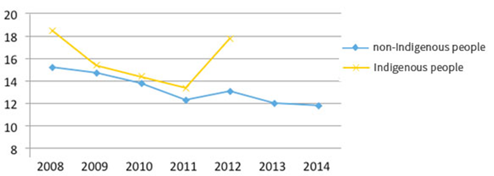
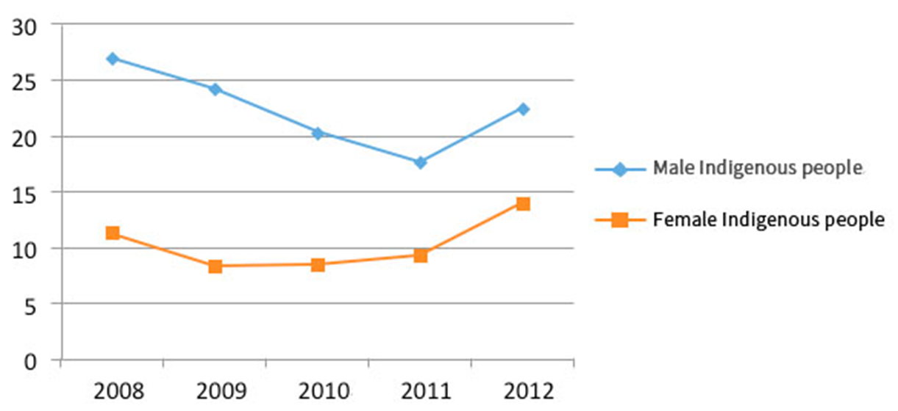

## Article 12 Right to Health

The States Parties to the ICESCR recognize the right of everyone to the enjoyment of the highest attainable standard of physical and mental health.

### Basic Social Factors of Health (Health Inequality)

<ol start="242">
  <li>
Violations of the right to health are not simply associated with the lack or improper allocation of medical and healthcare resources. Rather, these violations are extensions of numerous structural problems, such as improper social policy planning, unfair economic arrangement, and other factors, including material resources (e.g., finance and medical and healthcare equipment), power, opportunity, and other social determinants. According to the information presented in the second draft of the <em>State Report</em>, the difference between the life expectancy at birth of people in the regions with the weakest and strongest socioeconomic conditions is over 20 years. Based on the State Report, the government remains focused on the allocation of medical/material resources to maintain the right to health. In addition, public health policies remain centered on medical subsidization, establishment of medical facilities, and medical services, neglecting crucial social determinants of health.
</li>

  <li>
Although citizens receive adequate medical protection under the National Health Insurance Framework and medical resources, and fees are consistent in urban and rural regions, Taiwan still exhibits significant health inequalities, particularly concerning the disaggregation of people with disabilities, Indigenous people, income class, degree of urbanization, senior citizens, and nationality, where different groups receive different resources and medical care. The State Report fails to present data concerning the disaggregation of health data based on the suggested human rights indicators. Thus, the State Report does not accurately reflect the severity of health inequality in Taiwan.
</li>
</ol>

### Trade Agreement and Human Rights

<ol start="244">
  <li>
Taiwan’s economic is heavily reliant on international trade. During the evaluation of the social impact of <em>Free Trade Agreements</em>, the government failed to highlight the effects that trade agreements have on social health. For example, the effects that the Trans-Pacific Partnership Agreement (TPP) has on health rights have been widely discussed. One discussion centers on the higher level of protection that the TPP has on intellectual property than agreements on trade-related intellectual property rights (TRIPs) proposed by the WTO, such as the request that member countries adopt the patent linkage system and prolong the data exclusivity period for pharmaceutical products, which may defer the release of generic drugs in the market and significantly reduce the amount of affordable drugs available to the public.
</li>

  <li>
Another discussion highlights the failure to include the tobacco industry into the “Prohibited Industries for Foreign Investment Due to their Impact on Human Health” proposed by the Executive Yuan in accordance with Article 7 of the Statute For <em>Investment By Foreign Nationals</em>, enabling foreign tobacco companies to easily establish operations in Taiwan through investment trade agreements (Report No. 1040800152 issued by the Control Yuan).
</li>

  <li>
We urge that the government reference the <em>Guiding Principles on Human Rights Impact Assessments of Trade and Investment Agreements</em> (A/HRC/19/59/Add.5) published by a UN reporter on the right to food to evaluate the influences that major trade agreements and investment protocols have on human rights, particularly health rights. In addition, the government should define key human rights indicators during the formulation of major administrative plans, policies, and legislature to assess the impact that these formulations have on human rights.
</li>
</ol>

### Health Issues of Indigenous People

<ol start="247">
  <li>
The health inequality of the Indigenous people in Taiwan reflects the bias and mainstream ethnocentric hegemony of the government on the political and socioeconomic aspects of Indigenous people. According to extant government statistics, the life expectancy of Indigenous people is lower than non-Indigenous people in Taiwan in all age groups. Subsequently, poor life expectancy is closely attributed to the structural violence caused by the failure to secure the rights of Indigenous people. Severe health issues that are prevalent in the Indigenous community include women’s health, newborn mortality rate, accident fatality rate, alcohol abuse, suicide, tuberculosis, chronic hepatitis, cirrhosis, and metabolic syndrome. However, government departments intentionally medicalize, generalize, and individualize these health issues during the formation of health policies for Indigenous people, deferring the draft for the <em>Health Act for Indigenous People</em> – a draft based on Article 25 of the <em>Indigenous Peoples Basic Law</em> – from entering first reading. Moreover, the newly announced 2025 <em>White Paper on Health and Welfare Policy</em> omitted the Special Chapter on Indigenous People originally included in the 2020 <em>White Paper on Healthy Citizens</em>, severely violating the health rights of Indigenous people.
</li>

  <li>
The government should define health rights concepts based on the guidelines suggested by WTO. It should plan and establish meet systems and life improvement measures that are culturally safe and meet the needs of Indigenous people in Taiwan. Moreover, the government should expedite the ratification of the <em>Health Act for Indigenous People</em>, thereby ensuring that health and wellbeing of Indigenous people in Taiwan.
</li>
</ol>

### Universal Health Care System

<ol start="249">
  <li>
Overburden of Health Care Workers (Paragraph 238 of the <em>State Report on ICESCR</em>)

  
Government statistics show an increasing number of medical workers per million people in recent years, including physicians, dentists, nurses, and occupational therapists. However, numerous medical and nurse groups have successively emerged to bargain for more reasonable work conditions, suggesting that the allocation of medical human resources can still be improved, including the nurse-patient ratio – a highly discussed problem by the TWNU. We recommend that:

    <ol>
      <li>
The MOHW should disclose the <u>medical resources trends</u> of all counties and cities in the recent five years to illustrate the allocation of medical resources.
</li>

      <li>
The MOHW and the National Health Insurance Administration should maintain a reasonable nurse-patient ratio to ensure the rights of both laborers and patients. According to research conducted in the United States, a reasonable nurse-patient ratio is 1:4. European research outcomes indicate 1:6, while Japanese research recommends 1:7. Statistics released in 2013 show that the nurse-patient ratio in Taiwan was 1:13, clearly showing that the burden of nurses in Taiwan far exceeds those in other countries.
</li>
    </ol>
  </li>

  <li>
Disabling of Health Insurance Card (Paragraph 239 of the <em>State Report</em>)

  
Statistics released by the National Health Insurance Administration show that roughly 800,000 people default on their National Health Insurance (NHI) payments each month. Among these people, 770,000 are financially incapable of payment. Article 37 of the <em>National Health Insurance Act</em> stipulates that insurance coverage may be temporarily suspended for subscribers unwilling to make payments. This regulation is commonly known as “card disablement.” Although the applicability of this provision has been limited and the National Health Insurance Administration has implemented various relief measures, such as loans and installment plans, to help people in need, the poor propaganda of information and complexity of the application process have hindered the maximization of these measures. For example, homeless and unemployed persons remain hesitant to seek medical attention when their NHI cards have been disabled. The MOHW eliminated the regulation concerning card disablement after three consecutive defaults one week after the inauguration of President Tsai, benefiting 42,000 people. However, we believe that:

    <ol>
      <li>
The MOHW should honor the J. Y. Interpretation No. 472 issued on 29 January 1999, which stipulated that card disablement is a breach of people’s constitutional right and that assistant must be provided for people in financial hardship without discrimination.
</li>

      <li>
Amendments should be made to Article 37 of the <em>National Health Insurance Act</em> to eliminate card disablement regulations, instating other means to encourage payment from “those with the ability to make payment but choose not to do so.”
</li>
    </ol>
  </li>
</ol>

### Health Inequality (Paragraph 242 of the <em>State Report</em>)

<ol start="251">
  <li>
The State Report indicated that health inequality remains on health care and nursing care levels, neglecting the effects that the imbalance in income, wealth, labor conditions, social services, and political involvement have on people’s health. Although the NHI system in Taiwan has resolved the majority of health inequality issues, an analysis of the distribution of disease clearly shows that health inequality remains prevalent in Taiwan. The <em>Annual Report Promoting Your Health</em> published by the MOHW lacks health and survey statistics on people with mental and physical disabilities. The publication only targets disease treatment when discussing people with mental and physical disabilities. No discussions are centered on approaches to improve their social environments or socioeconomic status, resulting in the continuation of health inequality.
</li>

  <li>
We recommend that the government

    <ol>
      <li>
reinforce its statistics and indicators. According to Items 32 to 39 of the core documents, current health rights indicators comprise maternal mortality rate, infant mortality rate, family fertility rate, and the mortality rate of major death and diseases. These statistics illustrates a macro-perspective of current public health conditions, yet they are unable to indicate health inequality conditions clearly. Indicators that show the health gap between urban and rural areas, among different socioeconomic statuses, and among different ethnics should include. Health rights indicators should reflect more than simply disease statistics. Rather, they should constitute a complete 3A1Q framework in Taiwan. In addition, the social factors of substance addiction and obesity should also be elucidated to prevent stigma.
</li>

      <li>
We also recommend improving government hierarchies. Although the MOHW has announced a report on health inequality, this report was composed by an overseas team, and the composition process did not include domestic public participation. A report that aims to eliminate inequality yet dismisses citizen participation implies that the government remains oblivious of basic human rights principles. Moreover, eliminating health inequality is a transministry endeavor, similar to how different ministries are responsible for employment and labor conditions, housing, and environmental pollution. Therefore, the Executive Yuan should be tasked with composing health inequality reports and implementing policy suggestions.
</li>
    </ol>
  </li>
</ol>

### Treatment and Prevention of Rare Diseases and Relevant Health Care (Paragraph 244 of the <em>State Report</em>)

<ol start="253">
  <li>
The ratification of the Rare Disease Control and Orphan Drug Act in 2000 failed to stipulate the provision of information to rare disease patients and their family members. Article 8 of the Rare Disease Control and Orphan Drug Act was amended in 2015, stating “<em>When the central competent authorities are notified of the preceding items or when patients with rare genetic diseases are discovered, a designated professional should be assigned with the consent of the patient or legal guardian to provide disease information and effects to the patients and mental support, maternity care, and care counseling to the patient’s family members.</em>” However, regulations to support this amendment have yet to be implemented.
</li>

  <li>
The designated professional can apply for a permit license for uncertified drugs used to treat patients with rare diseases to claim for compensation from the NHI. Approved cases must acquire domestic a domestic drug license within three years to continue receiving compensation from the NHI. However, the lack of clinical trial data in Taiwan greatly increases the difficulty of acquiring drug approval. Even with the provisions of the <em>Rare Disease Control and Orphan Drug Act</em>, central competent authorities (FDA and MOHW) have not allocated a budget to encourage domestic pharmaceutical companies to conduct clinical trials and research, which indirectly and negatively influences the affordability of drugs used to treat rare diseases and patient survivability.
</li>
</ol>

### Mental Health (Paragraph 246-7 of the <em>State Report</em>):

<ol start="255">
  <li>
Homeless people: Different mental health promotion plans should be formulated to satisfy the diversity of Taiwan’s society. For example, social workers providing care to homeless people indicated that although a mental health network has been implemented, they have found that many homeless people with symptoms of mental illness have not been diagnosed by a physician, and therefore do not hold a disability card and are not monitored in the social welfare network.
</li>

  <li>
Migrant workers: Currently, Taiwan accommodates close to 600,000 industrial and social welfare migrant workers. They are uprooted, isolated, and lack support. Although they are covered by the NHI, they are challenged with numerous limitations when seeking medical attention. The number of cases of migrant worker suicides has increased in recent years. However, they are unable to acquire immediate mental health assistance. The Ministry of Labor should aim to provide mental health services promptly to migrant workers via different management systems.
</li>

  <li>
Indigenous people: The standardized mortality rate (SMR) of Indigenous people is far higher than non-Indigenous people (Fig. 4). Among Indigenous people, male suicides far exceed female suicides (Fig. 5). The suicide SMR of non-Indigenous people shows a gradual declining trend in recent years. By comparison, no such trend can be confirmed for Indigenous people because health statistics for Indigenous people have only been updated to 2012. Notably, a sudden spike in suicide rate can be observed in 2012 due to an increased number of Indigenous women suicides in that year. Suicide rates of Indigenous people across the world continue to rise. This trend is attributed to the degradation of their cultures, social structures, and socioeconomic situations. A similar problem is exhibited in Taiwan. The government is obligated to provide relevant information for confirmation.

  
  <figure>
    
    <figcaption>Figure 4 SMR of Indigenous and Non-Indigenous People in Taiwan</figcaption>
  </figure>

  <figure>
    
    <figcaption>Figure 5 Suicide SMR of Indigenous Men and Women</figcaption>
  </figure>
  </li>
</ol>

### People with Disabilities (Paragraphs 243 and 250-3 of the <em>State Report</em>):

<ol start="258">
  <li>
Paragraph 243 of the <em>State Report</em> only mentioned an older-adult health promotion plan and an age-friendly environment and services plan, with no mention of a health plan for people with disabilities. People with disabilities are less active than healthy people and are at higher risk of developing hypertension, hyperglycemia, and hyperlipidemia. Therefore, the government should not only establish a comprehensive database to serve as a basis for policy formulation but also formulate a plan for people with disabilities similar to the age-friendly environment and services plan.
</li>

  <li>
Among older adults over the age of 65, 19.6% more women require long-term care than men. Moreover, among older adults over the age of 80, 62.1% more women require long-term care than men; of which, people with severe disabilities account for 74.7%. The likeliness of women becoming disabled is higher than men. Therefore, the government should provision a larger proportion of resources to women’s care.
</li>

  <li>
Medical service utilization: The proportion of people with disabilities that use adult preventative health services account for roughly 15% to 16% of the overall number of people with disabilities in Taiwan, which is half the 32% utilization rate of healthy adults. The government has neither established health care policies/objectives for people with mental disabilities nor implemented effective measures to increase the utilization rate of preventative health services for people with disabilities.
</li>

  <li>
Accessibility of medical institutes: A survey report released in 2011 on the living conditions and demands of people with disabilities shows that 99.71% of people with disabilities are subscribed to the NHI. However, 57.27% were unable of independently seeking medical attention. A total of 20,245 community clinics is not included in the hospital accreditation system. Determining whether the facilities and services provided by these clinics meet accessibility standards is extremely difficult. Challenges for people with disabilities include:

    <ol>
      <li>
Physical obstruction: Many community clinics contain barriers or steps, making them difficult to access by people in wheelchairs. Mothers in wheelchairs are forced to wait outside when they accompany their children to the clinics.
</li>

      <li>
Lack of transport: During emergencies, such as the sudden onset of acute gastroenteritis, patients are unable to call a rehabus to large hospitals immediately, and community clinics are inaccessible.
</li>

      <li>
Medical equipment or facilities fail to meet the needs of people with disabilities: For example, mobile community health examination and screening stations contain stairs, making them difficult for women with disabilities to access. In addition, doctors and nurses often request that patients stand for x-rays, which may be difficult for people with severe disabilities or spinal injuries.
</li>

      <li>
Inability to acquire information: Medical institutes fail to provide physical or audio assistance to people with visual impairment, and their websites are not accessible to people with visual impairment. Moreover, health information and medical documents (incl., treatment instructions and survey consent forms) are not provided in a simple form or in braille, resulting in the ineffective delivery of the content to people with visual, mental, or learning disabilities.
</li>
    </ol>
  </li>

  <li>
The pregnancy and childbirth processes of women with disabilities are more complicated than those of healthy women. The delivery of prenatal health information and postnatal childcare information are especially difficult for women with disabilities because of physical limitations. We recommend that assigning a dedicated midwife to pregnant women with disabilities to deliver relevant health and childcare information, such as appropriate exercises for pregnant women, weight control, risky symptoms of pregnancy, postnatal care, and breastfeeding methods. In addition, maternal health booklets for women with disabilities should be more detailed and reader-friendly than those for healthy women and provide additional services items. Audio manuals and other appropriate formats should be available for pregnant women with visual impairment.
</li>

  <li>
Comprehensive oral care plans for people with special needs: Currently, 1,148,936 people with disabilities are residing in Taiwan. A comprehensive oral care plan for people with special needs primarily targets people that are difficult to administer dental treatment, those with severe and extremely severe disabilities (approx. 333,746 people), and older adults with disabilities. A total of 6,856 dental clinics and hospitals are currently registered with the NHI. Only 14% of these clinics and hospitals provide specialized dental services for people with disabilities, most of which only for people with mild to moderate physical disabilities or those with visual impairment. Many dental hospitals and clinics fail to provide accessible spaces, medical facilities, and support services, hindering people with disabilities from utilizing immediate oral care and treatment services.
</li>
</ol>

### Women Health Policies (Paragraph 261 of the <em>State Report</em>):

<ol start="264">
  <li>
To promote women’s health, the MOHW has introduced a number of health services centered on women’s reproductive health. However, these services are largely focused on fetal health rather than women’s health. For example, the content of the pregnancy and maternity health booklets provided by the MOHW largely focuses on caring for the fetus and fails to provide information concerning the symptoms or risks of the mother. A patient-doctor co-determination mechanism is unavailable, which may result in the overtreatment of pregnant women or overexposure to unnecessary health risks. Besides maternity care and women’s cancer screening, the government has yet to realize the risks of gender differences on women’s health. For example, a number of empirical studies have confirmed significant differences in clinical performance and response to treatment between men and women with heart conditions.
</li>

  <li>
Currently, gynecologists are unavailable in the majority of villages and townships in Taiwan. Moreover, the average age of gynecologists is five years older than that of other doctors. By 2022, 49% of the doctors specializing in obstetrics and gynecology would be 60 years and over. Although the <em>Childbirth Accident Emergency Relief Regulations</em> passed its third reading in 2015, which provisioned for additional funds to disperse childbirth accidents, the government has expressed a passive attitude towards the longstanding problem of inadequate payments, clearly evading the health rights of women.
</li>

  <li>
In the recent five years, the underage birth rate in Taiwan has maintained an average of 0.4%. According to 2014 statistics, the underage birth rate in Eastern Taiwan (e.g., Hualien and Taitung) was 1%, and that in Nantou and Miaoli County was 0.7%, clearly illustrating an urban-rural gap in underage birth rate.
</li>

  <li>
We recommend that the government formulate a reproductive care policy focusing on women, reinforce the diagnosis capability of medical staff, and take into account gender differences to prevent women from being exposed to unnecessary health risks. We also urge the government to take into account the recommendation of international experts and evaluate the effectiveness of existing sex education policies for underage persons, particularly in regions with high underage birth rates.
</li>
</ol>

### Infectious Disease Prevention

<ol start="268">
  <li>
Freedom of the homeless (Paragraph 262 of the <em>State Report</em>): According to the compulsory hospitalization, quarantine, and treatment guidelines for tuberculosis, patients suffering from tuberculosis that meet discharge/transfer criteria are free to leave the hospital unless they are considered uncooperative. However, homeless people are forced to remain in the hospital until they are cured, regardless of the type of medication they require. This may constitute an over-limitation of their personal freedom.
</li>

  <li>
According to the J. Y. Interpretation No. 690 issued by the Judicial Yuan recommend that the government promptly and comprehensively review the remedial procedures concerning the “necessary deposition” (incl., compulsory quarantine) defined in the <em>Communicable Disease Control Act</em>. Since the ratification of the <em>Habeas Corpus Act</em>, health authorities have been at risk of violating the personal freedom of patients with infectious diseases, those in contact with infectious diseases, or those suspected of carrying infectious diseases during the implementation of quarantine measures. The <em>Communicable Disease Control Act</em> has yet to be amended accordingly, leading to the emergence of disputes concerning the applicability of the <em>Habeas Corpus Act</em> in the implementation of specific measures, such as home quarantine and quarantine.
</li>

  <li>
Stigma and Discrimination Towards HIV:

    <ol>
      <li>
Reduced screening rate due to HIV stigma: Blood tests are the only method to test for HIV. The government should endeavor to provide friendly, confidential, effective, and convenience screening services, and eliminate/reduce the stigma associated with HIV, thereby increasing the willingness of the public to accept screening voluntarily. The HIV screening rate in Taiwan is roughly 75%, which is lower than the United States (87%) and the UN-recommended rate (90%). The reasons for the low screening rate are attributed to the lack of independent screening awareness, which is associated with the stigma associated with HIV. The government has introduced screening policies that highlight specific groups of people, which have biased general recognition of HIV. People generally believe that only homosexual people, people that engage in anal sex, or those that practice polyamory contract HIV. Society has even coined HIV as the “dirty disease” or “trash disease.”
</li>

      <li>
Inappropriate notification resulting in the dismissal of HIV carriers: Government policies consider HIV to be an infectious disease, and carriers of HIV must be tracked and managed. Notification systems fail to ensure the anonymity of HIV carriers. This has caused the National Defense University to expel a student who contracted HIV. Prior to his dismissal, the students were severely discriminated against, even prohibiting from swimming class, sharing kitchenware with others, and washing laundry with others, clearly reflecting the severe lack of health knowledge of the principle, teachers, and campus officers.
</li>

      <li>
Privacy protection and health rights of HIV carriers: Existing laws and regulations stipulate the HIV carriers are obligated to disclose their condition voluntarily to medical staff when seeking medical assistance. However, these laws and regulations do not prevent medical personnel from referring or rejecting treatment. Moreover, although the generalization of HIV is conceded, subsequent operations are less than subtle. For example, the NHI Administration has actively promoted the digitalization of medical information, such as medical records in the cloud. These endeavors have indirectly increased the difficulty of HIV carriers to seek medical assistance. During the release of inmates from correction institutions, the institution is required to notify the family members and local authorities of the inmate’s health conditions (incl., HIV status), which may lead to the abandonment. These examples clearly highlight the difference in people’s interpretation of HIV generalization. The generalization of HIV is an effective approach to eliminate stigma in the long-term. However, the process of generalization should be comprehensively reviewed, planned and restructured, based on human rights standards. Meaningful narratives should be opened with various groups to prevent sacrificing the rights of HIV carriers.
</li>
    </ol>
  </li>
</ol>

### Post-RCA Treatment (Paragraph 270 of the <em>State Report</em>)

<ol start="271">
  <li>
The carcinogenic effects of the organic solvents used by the Radio Corporation of America (RCA) lead to thousands of employees later developing cancer. Numerous public hazard and occupational accident groups successively filed appeals to the government over the period of a decade. On 17 April 2015, the Taipei District Court ruled in favor of the former employees of the RCA (first instance), requesting that relevant companies, including RCA and Thompson, collectively pay a compensation of NT $566.45 million, distributed among the former employees.
</li>

  <li>
The Ministry of Labor announced the “<em>Directions for Ministry of Labor to Handle the Condolence Payment for Labor’s Death from Diseases of Former RCA Taiwan Limited</em>” soon after the ruling in the court of the first instance. The compensation criteria were extremely stringent. The provisions limited compensation not only to employees in the Taoyuan Plant but also to the family members of employees who died of cancer as recorded in the verdict of Taipei District Court (first instance). On 23 October 2015, the Taoyuan County Former RCA Employees’ Solicitude Association and Occupational Injury Association proposed the following counteroffers:

    <ol>
      <li>
The Ministry of Labor should take into account the actual damage caused by the Former RCA, alleviating existing compensation criteria to include all affected employees and comprehensively reviewing the definition and compensation systems of occupational diseases in Taiwan.
</li>

      <li>
“Consolidation payment” should uphold the ideologies of the <em>Act for Protecting Worker of Occupational Accidents</em>, eliminating thresholds and fulfilling government subrogation.
</li>

      <li>
The Ministry of Labor should disclose the actual amount compensated and accept the supervision of occupational accident groups, labor unions, and the public.
</li>
    </ol>
  </li>
</ol>

### Substance Abuse (Paragraph 271-3 of the <em>State Report</em>):

<ol start="273">
  <li>
In terms of drug and alcohol abuse, efforts should not only be centered on consequential criminal punishment or forced treatment but also on abusers’ socioeconomic statuses and vulnerable family conditions. The current service systems for drug and alcohol abusers are insufficient. For example, (1) NHI coverage includes the concurrent symptoms of drug and alcohol abuse, but do not include alcohol and drug rehabilitation treatment, forcing abusers (those without mental symptoms) to cover roughly NT $20,000 to 30,000 in treatment fees. For abusers in financial hardship, these fees are unaffordable. The budget allocated by central competent authorities only enables county and city governments to organize the “Alcohol Abuse Treatment Program.” We recommend that the rehabilitation and treatment of alcohol a drug abuse be included into the coverage criteria of the NHI.
</li>

  <li>
The relapse rate after personal rehabilitation is extremely high without family and social support. Additional resources should be invested in strengthening community care services and establishing a case management and service model to provide psychological counseling, family support, social integration, and employment referral service to substance abusers.
</li>

  <li>
The mental symptoms of abusers and others with mental disabilities are relatively different. Descriptions of media providers and relevant units should be clearly distinguished to prevent public confusion, compromising the rights of people with disability cards, and mitigating the discrimination or rejection encountered by people with disabilities in the community or during rehabilitation. To avoid stigma, the government should focus on enhancing abusers’ willingness to ask for or receive treatment, helping them to reintegrate into normal life. We strongly recommend that police, health, social, education, and labor units collaboratively establish a social safety network to promote positive psychological and health education, resources, and channels within communities.
</li>
</ol>

### Workplace Health (Paragraph 275-6 of the <em>State Report</em>):

<ol start="276">
  <li>
The burden of proof for occupational accidents and injuries is on laborers and physicians. Besides occupational accidents that immediately affect health, such as cuts, falls, and accidents, which are easily identifiable, employers often deny the association between chronic or dormant illnesses with the workplace. The definitions for occupational injuries and illnesses established in Taiwan are extremely stringent and conservative, resulting in the compensation for occupational accidents and injuries to fall below international standards, specifically one-tenth to one-fiftieth of European countries.
</li>

  <li>
In reference to asbestos, the mesothelioma diagnosed in 98% of male patients can be associated with asbestos exposure. 73 cases of malignant mesothelioma were reported in Taiwan in 2010 alone. However, the occupational injury and illness compensation data announced by the Bureau of Labor Insurance indicate that less than 5 cases of asbestos-related lung disease and associated symptoms are reported each year. In addition, occupation-induced cancers are not classified, with less than 10 cases on average each year. Statistics released by the German government showed that 3,626 asbestos-related cases were compensated by occupational accident insurance in 2012. Data released by the Japanese government also indicated that 1,084 asbestos-related cases were compensated by occupational accident insurance in 2013. In the past, asbestos was commonly used in Taiwan. Thus, compared to the statistics of other countries, cases of asbestos-related occupational injury and illness cases in Taiwan is severely underestimated.
</li>

  <li>
In terms of the increasingly prevalent problem of workplace fatigue, current definitions associated with occupational injuries and illnesses are extremely stringent and mostly centered on cardiovascular disease. These definitions often exclude groups at lower risk of workplace fatigue, such as premenopausal women and younger adults, and overlook chronic illnesses, such as hypertension, metabolic syndrome, musculoskeletal disease, immune system disease, and reproductive system disease, as well as mental illnesses, such as anxiety and depression. Labor checks also use duty hours as an indicator of workload, overlooking the fact that workplace fatigue could also derive from psychosocial risks in the workplace, including labor policies, authoritarian management models, and reciprocal employee-employer relationships. The workplace health promotion plans introduced by the government largely focus on individual behaviors, such as exercise, weight loss, and diet, overlooking social risk factors. The government should review inappropriate labor policies, such as flexible hiring, and investigate the sources of work pressure at an institutional level, such as unstable hiring structures, salary structures (floating salaries), and workplace justice. In addition, the government should review the specification and implementation of duty hours, strengthen psychosocial hazards management in the workplace, and reinforce the workplace health survey at the institutional level.
</li>

  <li>
In terms of occupational health management, employees are obligated to receive periodic health checks by law and employers are obligated to cover the costs of these checks. According to a survey conducted by the Ministry of Labor in 2013, the majority of employees never received health checks, and over 70% of employees in the mining, gravel mining, and construction industries failed to undergo periodic health checks. Preventative occupational health checks are available to subscribers of the labor insurance for 27 categories of hazardous operations stipulated in the <em>Regulations of the Labor Health Protection</em>. However, this mechanism is only applicable to insured employees. No tracking and management services are available for retirees, and therefore it cannot effectively prevent diseases with long dormant periods.
</li>
</ol>

### Wind Turbine Noise Control (Paragraph 278-9 of the <em>State Report</em>)

<ol start="280">
  <li>
Current laws and regulations are inadequate to maintain the health rights of residents in the vicinity of wind turbines. A study published by the WHO indicated that the noise of wind turbines exceeding 32 decibels affected the sleep quality of nearby resident. Private groups referenced the findings of the WTO and the specifications of various countries and proposed a revised draft of the <em>Regulations for Installation and Management of Renewable Energy Generation Equipment</em> in 2014, suggesting that a reasonable and comfortable distance from wind turbine be established for dwellings, hospitals, schools, and other public buildings. However, the government has yet to amend the suggestions into the <em>Regulations for Installation and Management of Renewable Energy Generation Equipment</em> to ensure public health rights.
</li>

  <li>
The experimental hearing organized by the Bureau of Energy manifests no legal power in accordance with the provisions for administrative hearings stipulated in the <em>Administrative Procedure Act</em>. Since 2013, the government has not called any formal hearing procedure with legal power to regulate an appropriate distance for wind turbines, completely ignoring its policy concerning the right to citizen participation. Currently, numerous wind turbines along Taiwan’s western coastline remain extremely close to private residences (some less than 100 meters away). The lack of action by the government continues to violate the health rights of citizens affected by the turbines.
</li>
</ol>
